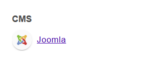

## Joomla

### Snelle Herkenning

#### 1. CURL

*Request:*

```
curl http://<domain>/administrator
```

*Response:*

```
Status: 200 OK
```


#### 3. HTML Tag

**Indien deze HTML tag zich bevindt in de desbetreffende homepagina:**

```
<meta name="generator" content="Joomla! - Open Source Content Management">
```

#### 4. Wappalyzezr

**Indien aangegeven bij de extensie wappalyzer:**




