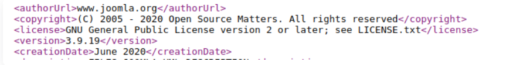
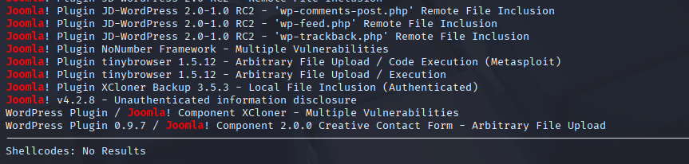

## Enumereren

### Overzicht

Controle en opsomming van alle kwetsbare onderdelen van een joomla website inclusief: Plugins, componenten, misconfiguraties en kwetsbare joomla versie.

#### 1. CURL (Versie Enumeratie)

*Request:*

```
curl http://<domain>/administrator/manifests/files/joomla.xml
```

*Response:*



#### 2. Exploit.db / Searchsploit (Versie Joomla)

```
searchsploit joomla <versie>
```

*Resultaat:*



#### 3. JoomScan Recon Tool

```
perl joomscan.pl --url <domain>
```

#### 4. Nuclei

```
nuclei -u http://<domain>
```

