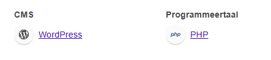

## Wordpress 

### Snelle Herkenning

#### 1. Curl

*Request:*

```
curl http://<domain>/wp-admin -I
```

*Response:*

```
Status: 302 FOUND
Redirect: /wp-login.php
```

#### 2. HTML Tags

- Website HTML Inspecteren
- Identificeren van classnames met bijv volgende tags:

**Voorbeeld**
```
<div class="entry-content wp-block-post-content is-layout-flow wp-block-post-content-is-layout-flow" bis_skin_checked="1">
```

#### 3. Wappalyzer

- Wappalyzer openen via extensie
- Toont vaak direct volgende icoon aan:

**Voorbeeld**
