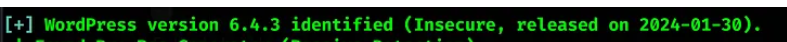
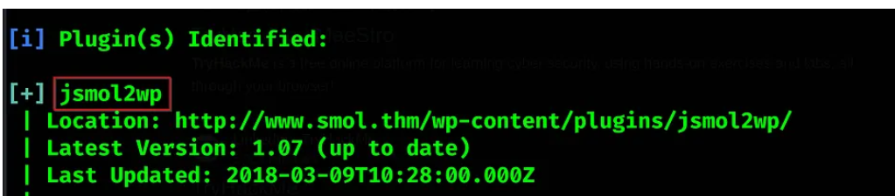
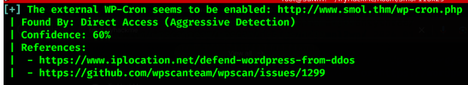

## Enumeratie

### Overzicht

Een idee krijgen van welke aanvalsvectoren gevonden kunnen worden op de geidentificeerde wordpress website.

#### Versie enumereren

##### 1. Nuclei

```
nuclei -u http://<domain>
```

```
[found result] [protocol] [info] -> information
```

#### Exploits, Plugins & andere aanvalsvectoren enumereren

```
wpscan --url http://<domain>
```




