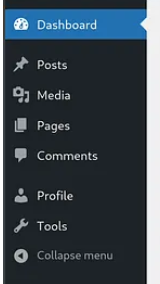
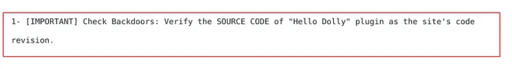

## Toegang tot wordpress paneel

### Overzicht

Eenmaal toegang verkregen tot het wordpress paneel door een publieke exploit, defecte plugin en/of brute force aanval, moet er een shell tot stand komen. 

#### Verkennen van opties binnen wordpress

##### 1. Posts / Pages

Kort checken of PHP code uploading en/of aanpassen toegestaan is op het paneel. Ook verwijderde posts door bekijken.

Ja:

    Upload webshell via revshells.com -> PHP reverse shell.

Nee:

    Kijk posts door voor mogelijk verborgen informatie over wachtwoorden, ssh keys of andere secrets.

##### 2. Media

Kort checken of het toegestaan is om andere types te uploaden dan alleen media files.

Ja:

    Upload webshell via revshells.com -> PHP reverse shell.

Nee:

    Kijk posts door voor mogelijk verborgen informatie over wachtwoorden, ssh keys of andere secrets.

##### 3. Comments

Kijk naar interessante informatie die zijn geplaatst in de commands, bijvoorbeeld:

*Indicatie dat er een backdoor is bijvoorbeeld of andere interessante informatie voor aanvalsvectoren*

##### 4. Tools

Kijk of er interessante Tools zijn aangesloten, die mogelijk effect kunnen hebben of aanvalsvectoren.

*Pagina Blanco / of geen tools te verkennen:*

    Skippen en door naar volgende aanvalsvector.