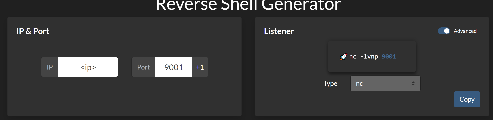

## Shell aanmaken

### Overzicht

Om een shell te verkrijgen moeten we dit natuurlijk eerst aanmaken, vanuit een RCE of andere mogelijkheid waar dit in verwerkt kan worden.

#### 1. Configuratie

*Bekend worden met eigen IP instellingen*

**Linux:**

```
ifconfig
```
resultaat:
```
inet <ip>
```
**Windows:**

```
ipconfig
```
resultaat:
```
 IPv4 Address. . . . . . . . . . . : <ip>
```

#### 2. Initialiseren

- Navigeren naar revshells.com
- Invoeren `<ip>` en port `9001`:

- Command uitvoeren in `CMD` tab:
    `nc -lvnp 9001`


