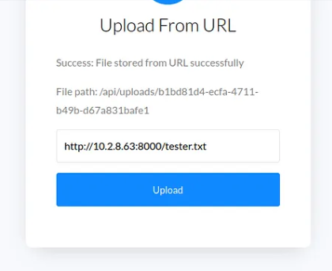
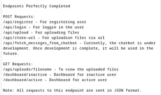

## Techniques

#### Login / Registration Failure

- After registration/login, getting message that the website is under development or will be fixed?
    - Check session cookies
        - JWT: Decode it for hidden params like:
            `"Subscription": "inactive"` and re-registrate again with `"Subscription": "active"`.
        - Inactive in url?
            `change /inactive` to `/active`

#### File upload with webshell obfuscated by api route?

- After uploading shell.php not working?
    - Look for a way to see if it gets uploaded in any other folder by fuzzing the name.
        - If name of file is changed and showed to you via a hash from `shell.php` to `hashmd51341224skdf234`. Dont even try, find another way.

#### Upload file via url function?

- Use it to get 403 pages that earlier you couldn't access via this functionality by entering:
    - Example: `http://127.0.0.1:<port>/<403url>`
        - It will return pages you havn't checked.

#### Hidden API Docs and unchecked functionalitys

- Checkout the `under development` endpoints.
    - Fuzz with the `/api/fetch_messages_dev` endpoint.
        - Change request method from `get` to `post`
        - Add `Context-Type` and `Context-Length` with data in it.
        - Do other stuff that the API gives back in response like:
            `missing params in api call, fill me daddy`

#### Check for SSTI in httprequest where it is reflected back to you,  when PHP, Python or other sketchy page.

- https://github.com/payloadbox/ssti-payloads
- https://www.yeswehack.com/learn-bug-bounty/server-side-template-injection-exploitation?source=post_page-----5d721bd08071---------------------------------------
- https://github.com/dgtlmoon/changedetection.io/security/advisories/GHSA-4r7v-whpg-8rx3?source=post_page-----5d721bd08071---------------------------------------

