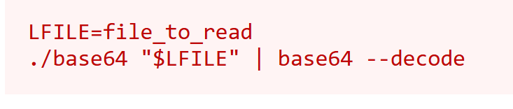

## SUID 

### Stapsgewijs

#### 1. Vind alle services en binarys met een SUID bit erin en execute privileges voor low priv user.

```
find / -type f -perm -04000 -ls 2>/dev/null
```

*voorbeeld:*
```
1722     44 -rwsr-xr-x   1 root     root             43352 Sep  5  2019 /usr/bin/base64
```

#### 2. GTFObins afzoeken naar SUID execution van service.



#### 3. exploit uitvoeren
