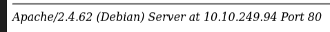

## recon (10.10.249.94)

### Steps

#### NMAP

```
nmap -sC -sV 10.10.249.94
```

**Result:**

```
PORT     STATE SERVICE VERSION
22/tcp   open  ssh     OpenSSH 9.2p1 Debian 2+deb12u6 (protocol 2.0)
| ssh-hostkey: 
|   256 63:ac:77:28:27:89:4a:1c:38:9f:94:7b:e4:5d:1c:de (ECDSA)
|_  256 dd:92:0b:7e:29:e6:55:da:b7:93:2c:5b:07:52:2c:6e (ED25519)
80/tcp   open  http    Apache httpd 2.4.62 ((Debian))
| http-title:             MagnusBilling        
|_Requested resource was http://10.10.249.94/mbilling/
| http-robots.txt: 1 disallowed entry 
|_/mbilling/
|_http-server-header: Apache/2.4.62 (Debian)
3306/tcp open  mysql   MariaDB 10.3.23 or earlier (unauthorized)
Service Info: OS: Linux; CPE: cpe:/o:linux:linux_kernel
```

#### Port 80

##### 1. Dirbuster

```
dirb http://10.10.249.94
```

**Resultaat:**

```
---- Scanning URL: http://10.10.249.94/ ----
+ http://10.10.249.94/akeeba.backend.log (CODE:403|SIZE:277)                                                                                                                                                                               
+ http://10.10.249.94/development.log (CODE:403|SIZE:277)                                                                                                                                                                                  
+ http://10.10.249.94/index.php (CODE:302|SIZE:1)                                                                                                                                                                                          
+ http://10.10.249.94/production.log (CODE:403|SIZE:277)                                                                                                                                                                                   
+ http://10.10.249.94/robots.txt (CODE:200|SIZE:37)                                                                                                                                                                                        
+ http://10.10.249.94/server-status (CODE:403|SIZE:277)                                                                                                                                                                                    
+ http://10.10.249.94/spamlog.log (CODE:403|SIZE:277)       
```

##### 2. Handmatig

*Version Apache:*



**MagnusBilling CMS**

- Verschillende exploits beschikbaar voor MagnusBilling CMS
    - Testen van exploit CVE-2023-30258
