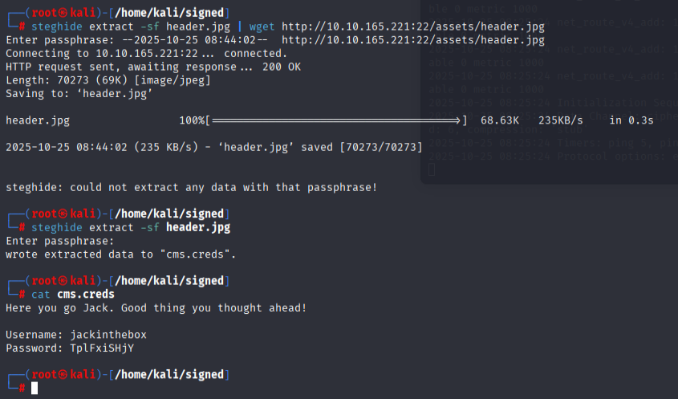

## Recon

### Steps to reproduce

#### Information

**NMAP**

```
PORT   STATE SERVICE VERSION
22/tcp open  http    Apache httpd 2.4.10 ((Debian))
|_http-title: Jack-of-all-trades!
|_ssh-hostkey: ERROR: Script execution failed (use -d to debug)
|_http-server-header: Apache/2.4.10 (Debian)
80/tcp open  ssh     OpenSSH 6.7p1 Debian 5 (protocol 2.0)
| ssh-hostkey: 
|   1024 13:b7:f0:a1:14:e2:d3:25:40:ff:4b:94:60:c5:00:3d (DSA)
|   2048 91:0c:d6:43:d9:40:c3:88:b1:be:35:0b:bc:b9:90:88 (RSA)
|   256 a3:fb:09:fb:50:80:71:8f:93:1f:8d:43:97:1e:dc:ab (ECDSA)
|_  256 65:21:e7:4e:7c:5a:e7:bc:c6:ff:68:ca:f1:cb:75:e3 (ED25519)
Service Info: OS: Linux; CPE: cpe:/o:linux:linux_kernel
```

#### Port 22 (changed to http??) / HTTP server

- version 2.4.10 of Apache

**Index.html Contents**

```
<html>
        <head>
                <title>Jack-of-all-trades!</title>
                <link href="assets/style.css" rel=stylesheet type=text/css>
        </head>
        <body>
                
                <h1>Welcome to Jack-of-all-trades!</h1>
                <main>
                        <p>My name is Jack. I'm a toymaker by trade but I can do a little of anything -- hence the name!<br>I specialise in making children's toys (no relation to the big man in the red suit - promise!) but anything you want, feel free to get in contact and I'll see if I can help you out.</p>
                        <p>My employment history includes 20 years as a penguin hunter, 5 years as a police officer and 8 months as a chef, but that's all behind me. I'm invested in other pursuits now!</p>
                        <p>Please bear with me; I'm old, and at times I can be very forgetful. If you employ me you might find random notes lying around as reminders, but don't worry, I <em>always</em> clear up after myself.</p>
                        <p>I love dinosaurs. I have a <em>huge</em> collection of models. Like this one:</p>
                        
                        <p>I make a lot of models myself, but I also do toys, like this one:</p>
                        
                        <!--Note to self - If I ever get locked out I can get back in at /recovery.php! -->
                        <!--  UmVtZW1iZXIgdG8gd2lzaCBKb2hueSBHcmF2ZXMgd2VsbCB3aXRoIGhpcyBjcnlwdG8gam9iaHVudGluZyEgSGlzIGVuY29kaW5nIHN5c3RlbXMgYXJlIGFtYXppbmchIEFsc28gZ290dGEgcmVtZW1iZXIgeW91ciBwYXNzd29yZDogdT9XdEtTcmFxCg== -->
                        <p>I hope you choose to employ me. I love making new friends!</p>
                        <p>Hope to see you soon!</p>
                        <p id="signature">Jack</p>
                </main>
        </body>
</html>
```

- Base64 encoded string `UmVtZW1iZXIgdG8gd2lzaCBKb2hueSBHcmF2ZXMgd2VsbCB3aXRoIGhpcyBjcnlwdG8gam9iaHVudGluZyEgSGlzIGVuY29kaW5nIHN5c3RlbXMgYXJlIGFtYXppbmchIEFsc28gZ290dGEgcmVtZW1iZXIgeW91ciBwYXNzd29yZDogdT9XdEtTcmFxCg==`
    - Decoded value:
    `Remember to wish Johny Graves well with his crypto jobhunting! His encoding systems are amazing! Also gotta remember your password: u?WtKSraq`

    - Gotta enumerate the user for this password!

- Got an entery point possible on:
`<!--Note to self - If I ever get locked out I can get back in at /recovery.php! -->` -> `/recovery.php`

**/recovery.php contents**

- base64 encoded string in the outcommented html tags
```
GQ2TOMRXME3TEN3BGZTDOMRWGUZDANRXG42TMZJWG4ZDANRXG42TOMRSGA3TANRVG4ZDOMJXGI3DCNRXG43DMZJXHE3DMMRQGY3TMMRSGA3DONZVG4ZDEMBWGU3TENZQGYZDMOJXGI3DKNTDGIYDOOJWGI3TINZWGYYTEMBWMU3DKNZSGIYDONJXGY3TCNZRG4ZDMMJSGA3DENRRGIYDMNZXGU3TEMRQG42TMMRXME3TENRTGZSTONBXGIZDCMRQGU3DEMBXHA3DCNRSGZQTEMBXGU3DENTBGIYDOMZWGI3DKNZUG4ZDMNZXGM3DQNZZGIYDMYZWGI3DQMRQGZSTMNJXGIZGGMRQGY3DMMRSGA3TKNZSGY2TOMRSG43DMMRQGZSTEMBXGU3TMNRRGY3TGYJSGA3GMNZWGY3TEZJXHE3GGMTGGMZDINZWHE2GGNBUGMZDINQ=
```

- on cybersheff -> base32 decode -> hex decode -> vigenere decode with key nnn

**Credentials in image**
```
steghide extract -sf header.jpg 
```


