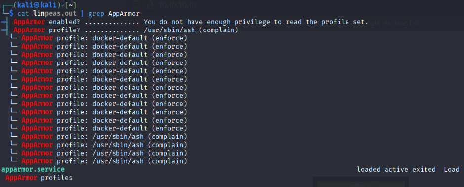

## Priv Esc

#### herkenning

**/opt/run_container.sh**

- heeft alleen read permission, geen write

#### Linpeas



**Running process genaamd AppArmor**

```
cd /etc/apparmor.d
```

```

  // Remove specific file path rules
  // Deny access to certain directories
  deny /opt/ r,
  deny /opt/** w,
  deny /tmp/** w,
  deny /dev/shm w,
  deny /var/tmp w,
  deny /home/** w,
  /usr/bin/** mrix,
  /usr/sbin/** mrix,

  //Simplified rule for accessing /home directory
  owner /home/** rix,
```

#### Verhuizing van /bin/bash naar writable directory /var/tmp


