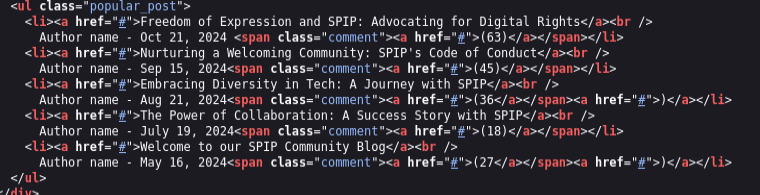
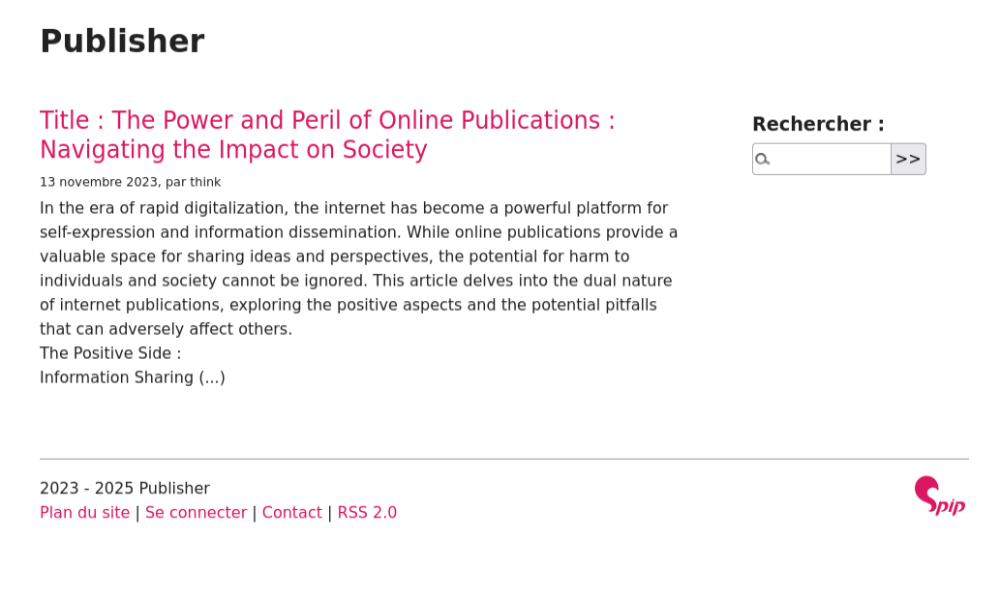

## recon (10.10.33.24)

#### nmap

```
nmap -sC -sV 10.10.33.24
```

```
PORT   STATE SERVICE VERSION
22/tcp open  ssh     OpenSSH 8.2p1 Ubuntu 4ubuntu0.13 (Ubuntu Linux; protocol 2.0)
| ssh-hostkey: 
|   3072 8e:11:d6:03:a6:e7:2b:30:73:36:70:b0:54:3e:7a:16 (RSA)
|   256 20:12:c8:9b:16:f3:ad:5d:5c:cc:20:36:6a:ae:9b:dd (ECDSA)
|_  256 39:bd:fd:16:e7:dc:66:41:9c:41:4f:56:66:86:81:63 (ED25519)
80/tcp open  http    Apache httpd 2.4.41 ((Ubuntu))
|_http-title: Publisher's Pulse: SPIP Insights & Tips
|_http-server-header: Apache/2.4.41 (Ubuntu)
Service Info: OS: Linux; CPE: cpe:/o:linux:linux_kernel
```

#### Port 80

##### SPIP (CMS)

**SPIP komt vaak voor terug in de statische pagina's**


```
http://publisher.thm/spip/
```

resultaat:




