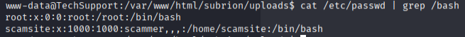
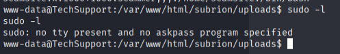
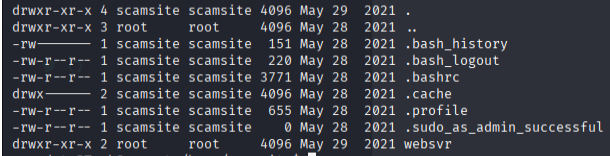
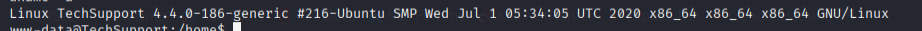
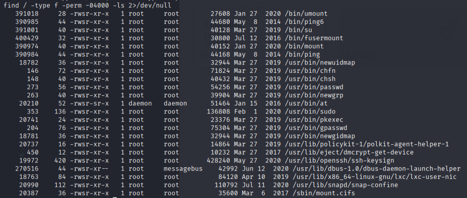
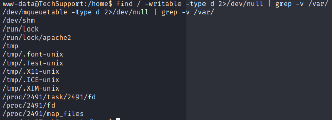
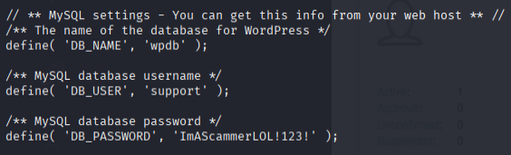
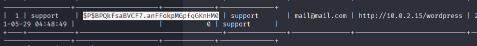
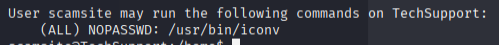
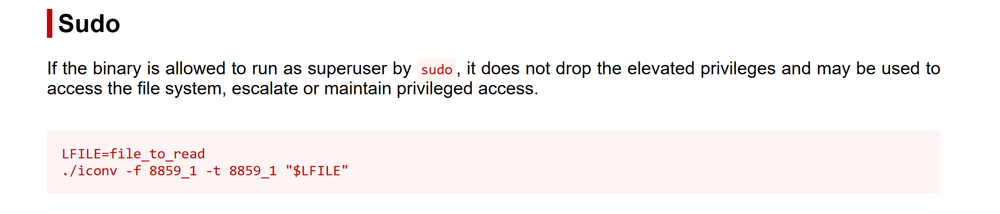

## privesc

### Steps

#### Users

#### Sudo

#### Folder /home/scamsite 

*We can write to it!!*

#### Kernel

#### No cronjobs

#### SUID bits

#### Writable folders

#### Mysql

**Wordpress Mysql creds**

#### Became user scamsite with creds of wp-config.php

`sudo -l`:

**GTFO Bins**

- will try to get root.txt
- got root.txt with the SUDO command