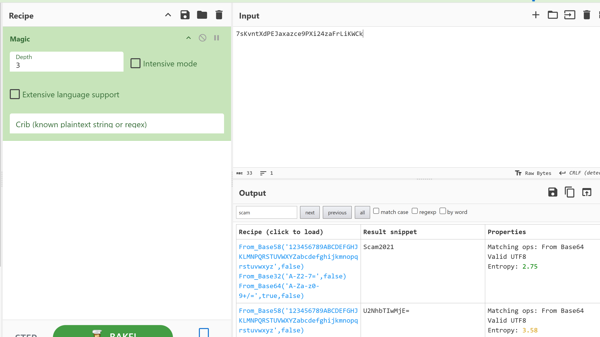

## Recon

### Steps

#### Information

**NMAP**

```
PORT    STATE SERVICE     VERSION
22/tcp  open  ssh         OpenSSH 7.2p2 Ubuntu 4ubuntu2.10 (Ubuntu Linux; protocol 2.0)
| ssh-hostkey: 
|   2048 10:8a:f5:72:d7:f9:7e:14:a5:c5:4f:9e:97:8b:3d:58 (RSA)
|   256 7f:10:f5:57:41:3c:71:db:b5:5b:db:75:c9:76:30:5c (ECDSA)
|_  256 6b:4c:23:50:6f:36:00:7c:a6:7c:11:73:c1:a8:60:0c (ED25519)
80/tcp  open  http        Apache httpd 2.4.18 ((Ubuntu))
|_http-server-header: Apache/2.4.18 (Ubuntu)
|_http-title: Apache2 Ubuntu Default Page: It works
139/tcp open  netbios-ssn Samba smbd 3.X - 4.X (workgroup: WORKGROUP)
445/tcp open  netbios-ssn Samba smbd 4.3.11-Ubuntu (workgroup: WORKGROUP)
Service Info: Host: TECHSUPPORT; OS: Linux; CPE: cpe:/o:linux:linux_kernel

Host script results:
| smb2-time: 
|   date: 2025-10-24T11:06:09
|_  start_date: N/A
|_clock-skew: mean: -1h49m42s, deviation: 3h10m30s, median: 16s
| smb-security-mode: 
|   account_used: guest
|   authentication_level: user
|   challenge_response: supported
|_  message_signing: disabled (dangerous, but default)
| smb-os-discovery: 
|   OS: Windows 6.1 (Samba 4.3.11-Ubuntu)
|   Computer name: techsupport
|   NetBIOS computer name: TECHSUPPORT\x00
|   Domain name: \x00
|   FQDN: techsupport
|_  System time: 2025-10-24T16:36:11+05:30
| smb2-security-mode: 
|   3:1:1: 
|_    Message signing enabled but not required

```

#### Port 80

**Directory enumeration**

*files*
```
/index.html           (Status: 200) [Size: 11321]
/index.html           (Status: 200) [Size: 11321]
/phpinfo.php          (Status: 200) [Size: 94945]
/phpinfo.php          (Status: 200) [Size: 94945]
```

*Directorys*

```
/test                 (Status: 301) [Size: 317] [--> http://techsupport.thm/test/]
/wordpress            (Status: 301) [Size: 322] [--> http://techsupport.thm/wordpress/]
```

**Wordpress site enumerated**

```
http://techsupport.thm/wordpress/wp-login.php?redirect_to=http%3A%2F%2Ftechsupport.thm%2Fwordpress%2Fwp-admin%2F&reauth=1
```

**wpscan**

```
[+] Headers
 | Interesting Entry: Server: Apache/2.4.18 (Ubuntu)
 | Found By: Headers (Passive Detection)
 | Confidence: 100%

[+] XML-RPC seems to be enabled: http://techsupport.thm/wordpress/xmlrpc.php
 | Found By: Direct Access (Aggressive Detection)
 | Confidence: 100%
 | References:
 |  - http://codex.wordpress.org/XML-RPC_Pingback_API
 |  - https://www.rapid7.com/db/modules/auxiliary/scanner/http/wordpress_ghost_scanner/
 |  - https://www.rapid7.com/db/modules/auxiliary/dos/http/wordpress_xmlrpc_dos/
 |  - https://www.rapid7.com/db/modules/auxiliary/scanner/http/wordpress_xmlrpc_login/
 |  - https://www.rapid7.com/db/modules/auxiliary/scanner/http/wordpress_pingback_access/

[+] WordPress readme found: http://techsupport.thm/wordpress/readme.html
 | Found By: Direct Access (Aggressive Detection)
 | Confidence: 100%

[+] Upload directory has listing enabled: http://techsupport.thm/wordpress/wp-content/uploads/
 | Found By: Direct Access (Aggressive Detection)
 | Confidence: 100%

[+] The external WP-Cron seems to be enabled: http://techsupport.thm/wordpress/wp-cron.php
 | Found By: Direct Access (Aggressive Detection)
 | Confidence: 60%
 | References:
 |  - https://www.iplocation.net/defend-wordpress-from-ddos
 |  - https://github.com/wpscanteam/wpscan/issues/1299

[+] WordPress version 5.7.2 identified (Insecure, released on 2021-05-12).
 | Found By: Emoji Settings (Passive Detection)
 |  - http://techsupport.thm/wordpress/, Match: 'wp-includes\/js\/wp-emoji-release.min.js?ver=5.7.2'
 | Confirmed By: Meta Generator (Passive Detection)
 |  - http://techsupport.thm/wordpress/, Match: 'WordPress 5.7.2'

[+] WordPress theme in use: teczilla
 | Location: http://techsupport.thm/wordpress/wp-content/themes/teczilla/
 | Last Updated: 2023-07-29T00:00:00.000Z
 | Readme: http://techsupport.thm/wordpress/wp-content/themes/teczilla/readme.txt
 | [!] The version is out of date, the latest version is 1.1.5
 | Style URL: http://techsupport.thm/wordpress/wp-content/themes/teczilla/style.css?ver=5.7.2
 | Style Name: Teczilla
 | Style URI: https://www.avadantathemes.com/product/teczilla-free/
 | Description: Teczilla is a creative, fully customizable and multipurpose theme that you can use to create any kin...
 | Author: avadantathemes
 | Author URI: https://www.avadantathemes.com/
 |
 | Found By: Css Style In Homepage (Passive Detection)
 |
 | Version: 1.0.4 (80% confidence)
 | Found By: Style (Passive Detection)
 |  - http://techsupport.thm/wordpress/wp-content/themes/teczilla/style.css?ver=5.7.2, Match: 'Version: 1.0.4'

[+] Enumerating All Plugins (via Passive Methods)

[i] No plugins Found.

[+] Enumerating Config Backups (via Passive and Aggressive Methods)
 Checking Config Backups - Time: 00:00:01 <==========================================> (137 / 137) 100.00% Time: 00:00:01

[i] No Config Backups Found.

[!] No WPScan API Token given, as a result vulnerability data has not been output.
[!] You can get a free API token with 25 daily requests by registering at https://wpscan.com/register

[+] Finished: Fri Oct 24 07:19:13 2025
[+] Requests Done: 184
[+] Cached Requests: 5
[+] Data Sent: 49.285 KB
[+] Data Received: 23.039 MB
[+] Memory used: 267.789 MB
[+] Elapsed time: 00:00:10

```

*Nothing to interesting*

**Enumerating usernames wordpress**

```
http://techsupport.thm/wordpress/readme.html
```

```
username	"support"
```

**Subrion panel**

```
http://10.10.54.226/subrion/panel
```

- cant login with the creds, prob need to use hashcat or john to cracks

7sKvntXdPEJaxazce9PXi24zaFrLiKWCk

**Cyber Shef**



*Used the hint in enter.txt littery with `cooked with magic`!!!*


#### Port 139/445

```
 smb-security-mode: 
|   account_used: guest
|   authentication_level: user
|   challenge_response: supported
|_  message_signing: disabled (dangerous, but default)
```

- User guest is allowed to login into shares

**netexec**

- requested shares
```
SMB         10.10.54.226    445    TECHSUPPORT      [+] \guest: (Guest)                                                                 
SMB         10.10.54.226    445    TECHSUPPORT      [*] Enumerated shares
SMB         10.10.54.226    445    TECHSUPPORT      Share           Permissions     Remark                                              
SMB         10.10.54.226    445    TECHSUPPORT      -----           -----------     ------                                              
SMB         10.10.54.226    445    TECHSUPPORT      print$                          Printer Drivers                                     
SMB         10.10.54.226    445    TECHSUPPORT      websvr          READ                                                                
SMB         10.10.54.226    445    TECHSUPPORT      IPC$
```

- We can read the websvr share

**Contents of smb share websvr**

```
  .                                   D        0  Sat May 29 03:17:38 2021
  ..                                  D        0  Sat May 29 03:03:47 2021
  enter.txt                           N      273  Sat May 29 03:17:38 2021
```

**Enter contents**

```
GOALS
=====
1)Make fake popup and host it online on Digital Ocean server
2)Fix subrion site, /subrion doesn't work, edit from panel
3)Edit wordpress website

IMP
===
Subrion creds
|->admin:7sKvntXdPEJaxazce9PXi24zaFrLiKWCk [cooked with magical formula]
Wordpress creds
|->
```