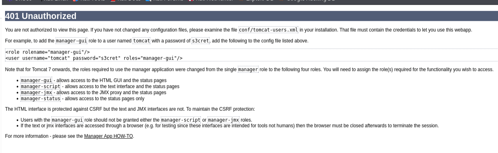
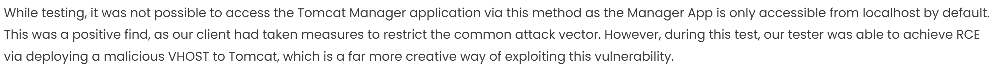

## Recon

### Steps

#### 1. Information

**NMAP**

```
PORT     STATE SERVICE VERSION
22/tcp   open  ssh     OpenSSH 7.2p2 Ubuntu 4ubuntu2.8 (Ubuntu Linux; protocol 2.0)
| ssh-hostkey: 
|   2048 fc:05:24:81:98:7e:b8:db:05:92:a6:e7:8e:b0:21:11 (RSA)
|   256 60:c8:40:ab:b0:09:84:3d:46:64:61:13:fa:bc:1f:be (ECDSA)
|_  256 b5:52:7e:9c:01:9b:98:0c:73:59:20:35:ee:23:f1:a5 (ED25519)
8009/tcp open  ajp13   Apache Jserv (Protocol v1.3)
|_ajp-methods: Failed to get a valid response for the OPTION request
8080/tcp open  http    Apache Tomcat 8.5.5
|_http-title: Apache Tomcat/8.5.5
|_http-favicon: Apache Tomcat
Service Info: OS: Linux; CPE: cpe:/o:linux:linux_kernel
```

#### Port 8009

- Apache Jserv - V1.3

#### Port 8080

- Apache Tomcat 8.5.5

**When going page login in and getting a 401 authorized page**



- Default credentials username:
    - username: tomcat
    - password: s3cret

- Credentials gave access to following link *Hostmanager*:

```
http://thompson.thm:8080/host-manager/html
```

**Article that talks about RCE when having access to host manager of tomcat**

`https://onsecurity.io/article/pentest-files-tomcat-rce-2/`

*Articles talks about achieving RCE with adding a virtual host??:*



*Github talking about uploading possibly*

`https://github.com/p0dalirius/Tomcat-webshell-application`
